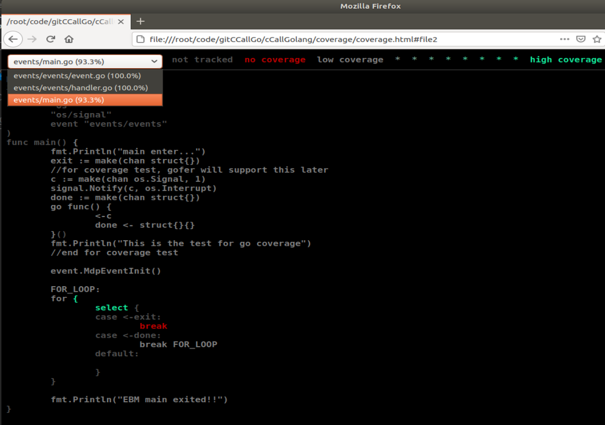

# test code for call golang functiong in C
# Get code coverage for system level test 

- [x] CGO
- [x] go test
- [x] coverage

## 1 CGO
In event.go, use C call "mdp_event_end_marker_handler()"

## 2 coverage
The script GETCOV will run ```go test``` to generate the code coverage.

## 3 Demo

